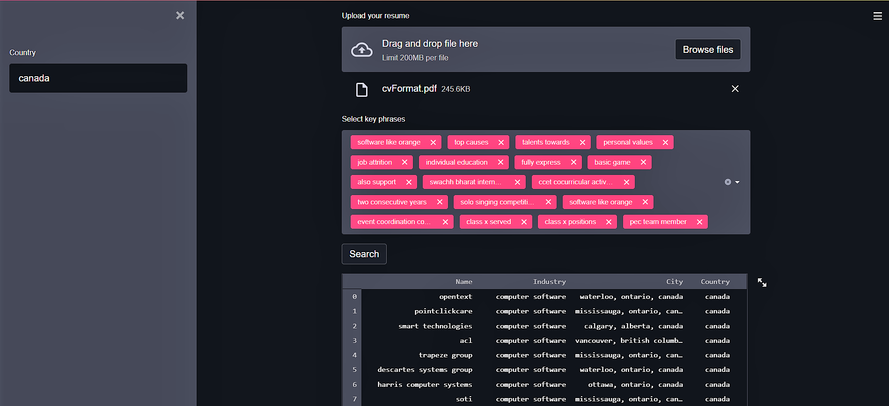

<h1 align="center">Job Recommender App</h1>


<!-- Status -->

<h4 align="center"> 
	 🚀 Streamlit based Job Recommendation App using MongoDB. 
</h4> 

<hr>

<p align="center">
  <a href="#dart-about">About</a> &#xa0; | &#xa0; 
  <a href="#rocket-technologies">Technologies</a> &#xa0; | &#xa0;
  <a href="#white_check_mark-requirements">Requirements</a> &#xa0; | &#xa0;
  <a href="#checkered_flag-starting">Starting</a> &#xa0; | &#xa0;
  <a href="#man_office_worker-contributing">Contributing</a> &#xa0; | &#xa0;
  <a href="#memo-license">License</a> &#xa0; | &#xa0;
  <a href="https://github.com/deepakm12" target="_blank">Author</a>
</p>

<br>

## 🎯 About ##

This is a simple job recommender app. The user will select the country they wish to work in and enter it. Then they have to upload their resume in pdf format. Subsequently, the app will analyze the uploaded file for key words in resume and will search a database of companies to find the most similar matches in the country.

## 🚀 Technologies ##

The following tools and libraries were used in this project:

- [Python](https://downloads.python.org/)
- [Pandas](https://pandas.pydata.org/)
- [Pymongo](https://pymongo.readthedocs.io/)
- [Streamlit](https://streamlit.io/)
- [pdfplumber](https://github.com/jsvine/pdfplumber)
- [PyPDF2](https://pythonhosted.org/PyPDF2/)
- [NLTK](https://www.nltk.org/)
- [Rake-NLTK](https://pypi.org/project/rake-nltk/)
- [mongodb](https://www.mongodb.com/)

## ✅ Requirements ##

Before starting 📍, you need to have:

✔ [Git](https://git-scm.com), 

✔ [Python 3.8](https://downloads.python.org/), 

and the above Libraries installed.

## 📍 Starting ##

📌 Clone this project

```bash
$ git clone https://github.com/muskaan712/JobRecommender
```

📌 Run the project

```bash
$ streamlit run main.py 
```
# 👨‍💼 Contributing ##
For major changes, please open an issue first to discuss what you would like to change.

# 🎞 Project Running ##

<div align="center" id="top"> 
  
  &#xa0;

</div>


## 📝 License ##

This project is under license from MIT. For more details, see the [LICENSE](LICENSE.md) file.


Made with by <a href="https://github.com/deepakm12" target="_blank">Deepak Mahto</a>

&#xa0;

<a href="#top">Back to top</a>
